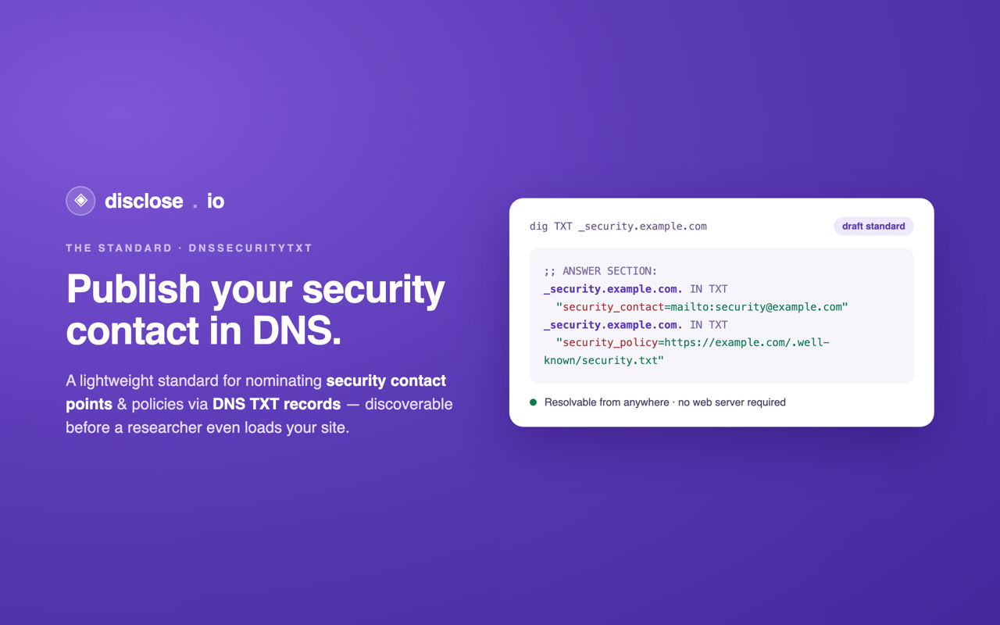

# dnssecuritytxt

### A standard for nominating security contact points & policies via DNS TXT records — discoverable before a researcher even loads your site.

*Part of [the disclose.io Project](https://disclose.io) · a DNS-native companion to [security.txt (RFC 9116)](https://www.rfc-editor.org/rfc/rfc9116)*

---

**A standard allowing organizations to nominate security contact points and policies via DNS TXT records.**  

> This proposal was first made public on March 25, 2021 and is currently a draft. We welcome comments and feedback! To make suggestions please submit a PR via Github or [submit a ticket](https://github.com/disclose/dnssecuritytxt/issues). Thanks for your interest!  

Find us on Twitter: [https://twitter.com/dnssecuritytxt](https://twitter.com/dnssecuritytxt).  

Created with <3 by [John Carroll](https://twitter.com/yosignals) and [Casey Ellis](https://twitter.com/caseyjohnellis) for [The disclose.io Project](https://disclose.io).